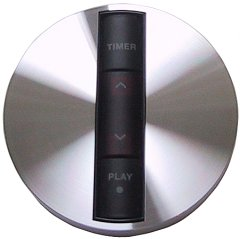
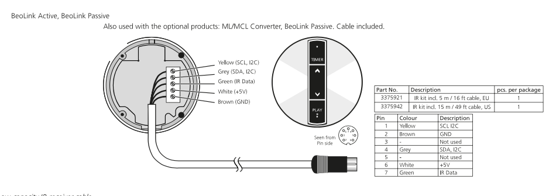

# esphome-beo-ir

Custom [ESPHome](https://esphome.io/) external component that decodes Bang & Olufsen Beo4/Beolink IR commands using the RP2040's PIO hardware. Decoded commands are published via Home Assistant for use in automations, Node-RED, or MQTT consumers.

Also supports the B&O IR eye's PCF8574T I2C I/O expander for physical button input and LED control using ESPHome's native `pcf8574` component.

Based on the [Beomote](https://github.com/christianlykke9/Beomote) Arduino library by Christian Lykke, re-implemented using RP2040 PIO hardware for more efficient IR decoding.

## How it works

The B&O IR protocol uses a 455 kHz carrier (demodulated by the IR eye into a digital signal). Symbols are encoded as gap durations measured in multiples of a 625 µs base tick. A frame consists of a START symbol, 1 link bit, 8 address bits, 8 command bits, and a STOP symbol.

The RP2040's PIO state machine counts ticks between falling edges and pushes the counts to a FIFO. The C++ component on the ARM core classifies tick counts into symbols and assembles complete frames. The PIO clock divider is computed dynamically from the actual system clock, so it works at both 125 MHz and 133 MHz.

## Requirements

### Hardware

- **Raspberry Pi Pico W** (RP2040)
- **B&O IR eye** — a passive [Beolink IR eye](https://beocentral.com/beolinkeye) receiver with a 5-pin connector.

  
- **3.3V/5V level shifter** — the IR eye outputs ~5V logic, but RP2040 GPIOs are rated for max 3.63V. Level shifting is required on:
  - IR data line
  - I2C SDA and SCL (if using the eye's buttons/LEDs)

  A [4-channel I2C-safe bidirectional level shifter](https://www.aliexpress.com/item/1005007050973483.html) works well — it handles both the I2C lines and the IR data signal with a single board.

### IR eye connector pinout



| Pin | Signal  |
|-----|---------|
| 1   | SCL     |
| 2   | SDA     |
| 3   | IR data |
| 4   | 5V      |
| 5   | GND     |

### Software

- [ESPHome](https://esphome.io/) 2024.1.0 or later (RP2040 platform support). Tested on 2026.3.0
- [Home Assistant](https://www.home-assistant.io/) with the ESPHome integration

### Default GPIO assignments

| Function | GPIO |
|----------|------|
| IR input | GP15 |
| I2C SDA  | GP4  |
| I2C SCL  | GP5  |

### Fitting the Pico inside the IR eye

The Pico W fits inside the IR eye housing — barely. To accommodate the Micro-USB power cable, widen and deepen the cable opening in the bottom of the eye housing. This lets the Micro-USB plug sit snugly and holds the Pico in place.

To avoid shorts against the eye's PCB and components, wrap the Pico board in Kapton tape and tape the level shifter to the Pico board with the same tape.

A 3D-printed enclosure or adapter would be the elegant solution — but tape and a craft knife get the job done.

## Installation

1. Copy the `components/beo_ir/` directory into your ESPHome config's `components/` folder.

2. Add the component to your device YAML:

```yaml
external_components:
  - source:
      type: local
      path: components

beo_ir:
  pin: 15
  pio: 0
  on_command:
    - then:
        - logger.log:
            format: "B&O[%s]: addr=0x%02X(%s) cmd=0x%02X(%s) link=%d repeat=%d"
            args:
              - source.c_str()
              - address
              - beo_address_name(address)
              - command
              - beo_command_name(command)
              - int(link)
              - int(repeat)
```

3. Compile and flash from the ESPHome dashboard.

See [example.yaml](example.yaml) for a complete configuration including MQTT publishing and IR eye button/LED setup.

## Configuration

### `beo_ir` component

| Option        | Required | Default | Description                                    |
|---------------|----------|---------|------------------------------------------------|
| `pin`         | Yes      | —       | GPIO pin connected to the IR data line (0–29)  |
| `pio`         | No       | `0`     | PIO instance to use (0 or 1)                   |
| `repeat_mode` | No       | `raw`   | How to handle held-button repeats (see below)  |
| `repeat_mode_select` | No | —    | Expose repeat mode as a Select entity in HA     |
| `eye_buttons` | No       | —       | List of IR eye physical buttons (see below)    |
| `on_command`  | No       | —       | Automation trigger for decoded commands         |

### `repeat_mode`

The Beo4 remote signals held buttons in three ways: button-specific repeat codes (e.g., YELLOW_REPEAT), repeated identical frames (e.g., VOLUME_UP sent repeatedly), and a generic REPEAT code (0x75). The `repeat_mode` option controls how these are handled:

| Mode        | Behaviour |
|-------------|-----------|
| `raw`       | Pass all codes through as-is. `repeat` is always `false`. |
| `translate` | Normalize all repeat mechanisms into the original command with `repeat: true`. |
| `suppress`  | Only fire on the initial press. All repeats are dropped. |

The `repeat_mode_select` option exposes the repeat mode as a Select entity in Home Assistant, allowing you to change it at runtime without reflashing:

```yaml
repeat_mode_select:
  name: "B&O Repeat Mode"
```

### `eye_buttons`

Physical buttons on the IR eye's PCF8574T I/O expander. Each button fires through the same `on_command` trigger as IR commands, with `source` set to `"eye"`. Repeat handling obeys the configured `repeat_mode`.

| Option    | Required | Default | Description                                        |
|-----------|----------|---------|----------------------------------------------------|
| `pin`     | Yes      | —       | GPIO pin (supports PCF8574 expander pins)          |
| `command` | Yes      | —       | B&O command code to fire (0–255)                   |
| `address` | No       | `0x01`  | B&O address code (default: AUDIO)                  |
| `repeat`  | No       | `false` | Generate repeat events when held                   |

Timing: 50 ms debounce, 400 ms initial delay before repeats start, then 200 ms repeat interval.

### `on_command` trigger variables

| Variable  | Type          | Description                                    |
|-----------|---------------|------------------------------------------------|
| `address` | `uint8_t`     | B&O device address (e.g., 0x01 for AUDIO)      |
| `command` | `uint8_t`     | B&O command code (e.g., 0x60 for VOLUME_UP)    |
| `link`    | `bool`        | True if the link bit was set                    |
| `repeat`  | `bool`        | True if this is a repeated press (held button)  |
| `source`  | `std::string` | `"ir"` for remote commands, `"eye"` for physical buttons |

Helper functions `beo_address_name(address)` and `beo_command_name(command)` return human-readable names for known codes.

## MQTT publishing

The ESPHome `mqtt:` component is not supported on RP2040. The workaround is to use the native API (`api:`) and call Home Assistant's `mqtt.publish` service:

```yaml
- homeassistant.service:
    service: mqtt.publish
    data:
      topic: beo2mqtt/command
      payload: !lambda |-
        char buf[256];
        snprintf(buf, sizeof(buf),
          "{\"BeoSource\":\"%s\",\"Beolink\":%d,"
          "\"BeoAddress\":%d,\"BeoAddressName\":\"%s\","
          "\"BeoCommand\":%d,\"BeoCommandName\":\"%s\","
          "\"BeoRepeat\":%s}",
          source.c_str(),
          link ? 1 : 0,
          address, beo_address_name(address),
          command, beo_command_name(command),
          repeat ? "true" : "false");
        return std::string(buf);
```

## IR eye buttons and LEDs

The IR eye has a PCF8574T I/O expander with 4 physical buttons and 2 LEDs. I2C must run at 10 kHz for reliable communication through the level shifter.

**Buttons** are configured via `eye_buttons` in the `beo_ir` component. They fire through the same `on_command` trigger as IR commands, with debouncing and configurable repeat handling that obeys the `repeat_mode` setting.

**LEDs** use ESPHome's native `pcf8574` GPIO switch — no custom code needed.

| PCF8574T Pin | Direction | Function                  |
|--------------|-----------|---------------------------|
| P0           | Input     | Timer button              |
| P1           | Input     | Volume Up button          |
| P2           | Input     | Volume Down button        |
| P3           | Input     | Play button               |
| P4–P5        | —         | Unused                    |
| P6           | Output    | Standby LED (active low)  |
| P7           | Output    | Timer LED (active low)    |

See [example.yaml](example.yaml) for the full I2C/button/LED configuration.

## Example use case: Beo4 remote → Google TV

This project was built to control a Google TV with Chromecast connected to a Bang & Olufsen BeoVision 11. The BeoVision has no HDMI CEC support, so there is no way to control the Chromecast using the Beo4 remote out of the box.

The setup:

1. A B&O IR eye is placed next to the TV and wired to a Pico W running this component.
2. Decoded Beo4 commands are published to MQTT via Home Assistant.
3. A Node-RED flow on the HA host picks up the MQTT messages and translates them into commands for the Google TV's [Android TV Remote](https://www.home-assistant.io/integrations/androidtv_remote/) entity in Home Assistant.
4. The flow checks two conditions before forwarding commands:
   - The Google TV media player state is `playing`
   - The BeoVision 11 (via the [BeoPlay integration](https://github.com/giachello/beoplay)) is on the HDMI input where the Chromecast is connected

Button mapping used:

| Beo4 button | Google TV action |
|-------------|------------------|
| NAV_UP / NAV_DOWN / NAV_LEFT / NAV_RIGHT | D-pad navigation |
| NAV_GO | Select / OK |
| BACK | Back |
| PLAY | Play |
| STOP | Stop |
| GREEN | Home |

This approach works for any device that exposes a remote entity in Home Assistant — the Beo4 becomes a universal remote through IR → MQTT → Node-RED → HA.

## License

MIT
